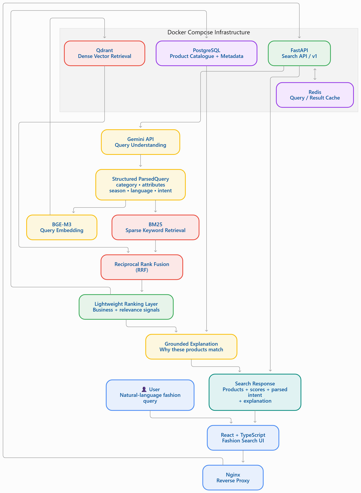

# Fashion Recommendation & Semantic Search System

> A production-oriented multilingual fashion discovery system that converts natural-language requests into structured intent and combines dense semantic retrieval with sparse lexical retrieval to produce relevant, explainable product recommendations.

---

## 1. Overview

Fashion search is often expressed in natural language rather than structured filters.

A user may search for:

- `lightweight comfortable clothes for summer`
- `office wear for women`
- `गर्मियों के लिए हल्के और आरामदायक कपड़े`
- `கோடைக்கு வசதியான லைட் வெயிட் ஆடைகள்`

Traditional keyword search can struggle with multilingual queries, implicit preferences, semantic similarity, and evolving product catalogues.

This project addresses that problem through a **multilingual semantic fashion recommendation and search pipeline** combining:

- Gemini-based query understanding
- Structured intent extraction
- BGE-M3 multilingual embeddings
- Dense vector retrieval
- Sparse BM25 retrieval
- Reciprocal Rank Fusion (RRF)
- PostgreSQL product metadata
- Redis caching
- Qdrant vector search
- Lightweight ranking
- Grounded recommendation explanations
- Retrieval evaluation and ablation experiments
- Dockerized execution

The system is designed as a **measurable retrieval system**, rather than treating the LLM itself as the product-ranking mechanism.

---

# 2. Problem Statement

Build a fashion discovery system that can understand multilingual natural-language requests, retrieve semantically relevant products from an evolving catalogue, and provide measurable evidence of retrieval quality.

The system should:

1. Understand natural-language fashion requests.
2. Extract structured intent and attributes.
3. Support multilingual queries.
4. Retrieve products using semantic and lexical signals.
5. Combine dense and sparse retrieval.
6. Rank results using measurable retrieval logic.
7. Provide grounded explanations for recommendations.
8. Support evaluation through a manually reviewed golden set.
9. Provide reproducible local execution.
10. Have a clear path toward production-scale deployment.

---

# 3. Key Features

## Natural-Language Query Understanding

Gemini converts a user query into a structured representation containing information such as:

- intent
- category
- occasion
- season
- attributes
- language
- normalized query

Example:
````markdown
```text
User query: "lightweight comfortable clothes for summer"
Parsed intent:
- Intent: Search
- Category: Clothing
- Season: Summer
- Attributes: Lightweight, Comfortable
- Language: English
```
````
## Multilingual Semantic Search
The system uses **BGE-M3** embeddings to support semantic retrieval across multilingual fashion queries.

## Hybrid Retrieval

**the production retrieval path combines**

````markdown

Dense Retrieval
       +
Sparse BM25 Retrieval
       ↓
Reciprocal Rank Fusion
       ↓
Lightweight Ranking
       ↓
Final Product Results

````

**Dense retrieval** : captures the semantic similarity
**Sparse retrieval** : captures the lexical level signals like producing the exact signals like the brand searching - Nike 
**RRF** : combines the ranking signals without requiring the underlying retrieval scores to be directly comparable.

## Role of the LLM in understading the Query
The LLM does not directly choose the final products
The pathway for the decision:

````markdown

User Query
    ↓
Gemini
    ↓
Structured ParsedQuery
    ↓
Retrieval
    ↓
Fusion
    ↓
Ranking
    ↓
Products

````

This separation keeps retrieval quality measurable and allows the retrieval pipeline to be evaluated independently from the language-model interpretation layer.


##Grounded Recommendations:
The project contains explanation and explanation-quality components designed to keep recommendation explanations grounded in retrieved product information.
The explanation layer is treated separately from the retrieval/ranking decision path.

## Evaluation Framework

The project contains a dedicated evaluation pipeline covering:

    nDCG@10
    Recall@10
    MRR
    dense vs sparse vs hybrid retrieval
    hybrid + reranker experiment
    multilingual parity
    manually reviewed golden candidates
The evaluation uses a manually reviewed subset rather than relying exclusively on automatically generated labels.


##Dockerized Execution:
The applicaition is packaged using Docker Compose:
The local architecture contains
      Frontend
      Backend
      PostgreSQL
      Qdrant
      Redis


## Architecture:
A high level architecture diagram:
<h2 align="center">System Architecture</h2>

<p align="center">
  
</p>

````markdown
```
                         ┌──────────────────────┐
                         │        USER          │
                         └──────────┬───────────┘
                                    │
                                    ▼
                         ┌──────────────────────┐
                         │ React + TypeScript   │
                         │      Frontend        │
                         └──────────┬───────────┘
                                    │
                                    ▼
                         ┌──────────────────────┐
                         │        Nginx         │
                         │    Reverse Proxy     │
                         └──────────┬───────────┘
                                    │
                                    ▼
                         ┌──────────────────────┐
                         │     FastAPI API      │
                         └──────────┬───────────┘
                                    │
                     ┌──────────────┴──────────────┐
                     │                             │
                     ▼                             ▼
             ┌───────────────┐             ┌─────────────┐
             │ Gemini Parser │             │    Redis    │
             │ Query Intent  │             │    Cache    │
             └───────┬───────┘             └─────────────┘
                     │
                     ▼
              Structured Query
                     │
                     ▼
               BGE-M3 Embedding
                     │
              ┌──────┴──────┐
              │             │
              ▼             ▼
       Dense Retrieval   Sparse Retrieval
          Qdrant              BM25
              │             │
              └──────┬──────┘
                     ▼
          Reciprocal Rank Fusion
                     │
                     ▼
             Lightweight Ranker
                     │
                     ▼
               Product Results
                     │
              ┌──────┴──────┐
              ▼             ▼
        PostgreSQL      Explanation
       Product Data       Layer
```
````
The detailed architecture id documented seperatley in the: 
docs/architecture.md 


## Technology Stack:


| Layer | Technology |
| :--- | :--- |
| **Frontend** | React + TypeScript + Vite |
| **Styling** | Tailwind CSS |
| **Backend** | FastAPI |
| **API Models** | Pydantic v2 |
| **LLM** | Gemini API |
| **Embeddings** | BGE-M3 |
| **Dense Retrieval** | Qdrant |
| **Sparse Retrieval** | BM25 |
| **Fusion** | Reciprocal Rank Fusion |
| **Ranking** | Lightweight Ranker |
| **Database** | PostgreSQL |
| **Cache** | Redis |
| **Containerization** | Docker + Docker Compose |
| **Testing** | Pytest |
| **Migrations** | Alembic |


## End-to-end Search Pipeline:
````markdown
```
                    User Query
                        │
                        ▼
                Gemini Query Parser
                        │
                        ▼
                 Structured Query
                        │
              ┌─────────┴─────────┐
              │                   │
              ▼                   ▼
        Hard Filters        Normalized Query
                                  │
                                  ▼
                           BGE-M3 Embedding
                                  │
                     ┌────────────┴────────────┐
                     │                         │
                     ▼                         ▼
               Dense Retrieval          Sparse Retrieval
                  Qdrant                     BM25
                     │                         │
                     └────────────┬────────────┘
                                  ▼
                               RRF Fusion
                                  │
                                  ▼
                         Lightweight Ranking
                                  │
                                  ▼
                           Final Products
                                  │
                                  ▼
                         Explanation Layer
```
````

## Dataset:
This project uses the Amazon Fashion dataset:
the source catalogue contains production information such as:
    product title
    category
    description
    features
    rating
    rating count
    price
    images
    store information
The raw dataset is not committed to the Git because of its size
```` markdown
```
To get the dataset: https://amazon-reviews-2023.github.io/

```
````

## Retrieval Evaluation
Evaluation is based on a manually reviewed golden subset.

The primary retrieval metrics are:
- nDCG@10
- Recall@10
- MRR

- 
| Retrieval Pipeline     | nDCG@10 | Recall@10 |    MRR |
| :--------------------- | ------: | --------: | -----: |
| Dense BGE-M3           |  0.7530 |    0.4275 | 0.8356 |
| Sparse BM25            |  0.7000 |    0.3587 | 0.7267 |
| **Hybrid + RRF**       | **0.9010** | **0.8378** | **0.9500** |
| Hybrid + BGE Reranker  |  0.8532 |    0.6463 | 0.9250 |

**Interpretation** 

On the evaluated golden set, the hybrid dense + sparse retrieval pipeline achieved the strongest measured retrieval performance among the tested configurations.
The hybrid system achieved:
nDCG@10   = 0.9010
Recall@10 = 0.8378
MRR       = 0.9500

instead of a BGE Reranker a lightweight re ranker has been used
so the BGE re ranker has not been included in the production path
This is an evaluation-driven engineering decision rather than an assumption that adding another model automatically improves retrieval quality.

**The detailed results for this eval is available in** : backend/evals/reports/
**documented in** : docs/evaluation.md


## Additional Exploration:
Several retrieval configurations were implemented and compared.
**Dense Retrieval**
BGE-M3 embeddings are used for semantic retrieval through Qdrant.
**Strengths**
 - semantic similarity
 - Multilingual representation
 - Robustness to vocabulary variation

**Limitation**
 -Exact lexical/product terminology can be missed.


 **Sparse retrieval**
 BM25 provides lexical retrieval.
 **Strenghts**
-Exact terminology
-Product-specific vocabulary
-Strong lexical matching

**Limitations**
-Exact lexical/product terminology can be missed.


**Hybrid Retrieval**
 -Dense and sparse retrieval are combined using Reciprocal Rank Fusion.
 - Measured performance:
 - nDCG@10   = 0.9010
 - Recall@10 = 0.8378
 - MRR       = 0.9500


**Reranker Experiment**
 -A BGE reranker was also evaluated.

 ``` markdown
```
Hybrid:
nDCG@10   = 0.9010
Recall@10 = 0.8378
MRR       = 0.9500

Hybrid + Reranker:
nDCG@10   = 0.8532
Recall@10 = 0.6463
MRR       = 0.9250
```
````
Since the measured reranker configuration degraded the evaluation metrics, it is not enabled in the production retrieval path.

More documentation:
 ````markdown
```
docs/additional-exploration.md
```
````

## Production -Scale considerations

 The current implementation is a production-oriented local prototype.
The architecture can be extended for larger catalogues and higher traffic.

  **API Scaling**
  FastAPI services can be horizontally scaled behind a load balancer.

  ````markdown
                    Load Balancer
                         │
             ┌───────────┼───────────┐
             ▼           ▼           ▼
          API #1       API #2       API #3
```
````

 **Vector Search Scaling**
   Qdrant can be deployed in a distributed configuration with appropriate replication and sharding strategies.
  The vector index should remain a derived/rebuildable representation of the authoritative product catalogue.

  **Database Scaling**
  PostgreSQL can be extended using:
- read replicas
- connection pooling
- appropriate indexing
- partitioning where justified
PostgreSQL remains the authoritative product metadata store.

**Incremental Catalogue Ingestion**
An evolving catalogue should not require rebuilding the complete index for every update.
A scalable ingestion architecture can follow:

````markdown
```
Catalogue Update
       │
       ▼
Validation
       │
       ▼
PostgreSQL
       │
       ▼
Embedding Generation
       │
       ▼
Vector Index Update

```
````

**Caching**
Redis can be used to cache:
- repeated query results
- parsed query representations
- frequently accessed product information
Cache invalidation should be tied to catalogue/version changes where appropriate.

**Model Serving**
At higher traffic volumes, embedding generation and model inference can be moved into dedicated model-serving workers.
Batching can reduce inference overhead.

**Observability**
A production deployment should monitor:
- request latency
- LLM latency
- embedding latency
- retrieval latency
- cache hit rate
- API error rate
- retrieval quality
- query volume
- resource utilization

**Reliability**
Production deployment should include:
- health checks
- request timeouts
- controlled retries
- graceful degradation
- rate limiting
- structured logging
- secret management
- CI/CD
- monitoring and alerting
More detailed production considerations are documented in:

````markdown
```

docs/production-scale.md
```
````

## Reliability and Graceful Degradation:
The architecture separates optional dependencies from the core retrieval path wherever possible.

The goal is to avoid making every auxiliary component a single point of failure.


## API endpoints
**Health**
GET /health

Used for service health checks.

**Search**
GET /v1/search

**Example**
GET /v1/search?q=summer%20dress&page=1&page_size=20

**Recommendation**
POST /v1/recommend

The recommendation endpoint provides a portfolio-facing end-to-end recommendation interface

## Running the system
**Pre- requisites**
Install:
- Docker Desktop
- Git
A Gemini API key is required for query understanding.

**Environmental Configuration**
reate a local .env file based on:
````markdown
```
.env.example
```
````

Set:
````markdown
```
GEMINI_API_KEY=your_key_here
```
````

Never commit .env to GitHub.
The repository's .gitignore excludes local environment files and large datasets.


##Start the Application:

From the repository root:

````markdown
```
docker compose up --build
```
````

**Frontend**

Open:
````markdown
```
http://localhost:3000
```
````
The frontend communicates with the backend through the Nginx reverse proxy.

**Backend**
The Fast API backend runs on:

````markdown
```
http://localhost:8000
```
````
Heath check:

````markdown
```

http://localhost:8000
```
````

## 📁 Project Structure

```text
fashion-search/
│
├── backend/
│   ├── embedding/
│   │
│   ├── evals/
│   │   └── reports/
│   │
│   ├── explanation/
│   │
│   ├── llm/
│   │
│   ├── migrations/
│   │
│   ├── query_understanding/
│   │
│   ├── reranking/
│   │
│   ├── scripts/
│   │
│   ├── search/
│   │
│   ├── search_api/
│   │   ├── routes/
│   │   └── services/
│   │
│   ├── shared/
│   │
│   ├── sparse/
│   │
│   ├── tests/
│   │
│   └── vector_store/
│
├── frontend/
│   ├── public/
│   └── src/
│       ├── components/
│       ├── lib/
│       └── pages/
│
├── docs/
│   ├── architecture.md
│   ├── evaluation.md
│   ├── additional-exploration.md
│   └── production-scale.md
│
├── docker-compose.yml
├── .dockerignore
├── .env.example
├── .gitignore
└── alembic.ini

```
#  Engineering Decisions

## Why Gemini?

Gemini is used for natural-language query understanding rather than directly selecting products.

This separates language interpretation from retrieval and ranking.

---

## Why BGE-M3?

BGE-M3 provides multilingual dense representations suitable for semantic retrieval.

---

## Why BM25?

BM25 provides complementary lexical retrieval and helps preserve exact terminology matching.

---

## Why Hybrid Retrieval?

Dense and sparse retrieval capture complementary information.

The evaluation demonstrated that the hybrid configuration achieved the strongest measured retrieval performance among the tested configurations.

---

## Why RRF?

Reciprocal Rank Fusion allows rankings from heterogeneous retrieval systems to be combined without requiring their raw scores to be directly comparable.

---

## Why Not Enable the Reranker?

The reranker was evaluated experimentally.

The measured results were lower than the hybrid baseline.

Therefore, the production path prioritizes the empirically stronger configuration.

---

#  Limitations

The current system has several limitations:

1. The evaluation golden set is relatively small.
2. Tamil and Hindi evaluation subsets are smaller than the English subset.
3. The current catalogue contains 20,000 products.
4. The current deployment uses Docker Compose rather than a distributed cloud deployment.
5. Gemini introduces an external API dependency and associated latency.
6. Production-scale distributed infrastructure is described architecturally but is not required for the current local deployment.
7. Multilingual evaluation should be expanded with more manually reviewed queries.

These limitations are intentionally documented rather than hidden.

---

#  Future Improvements

Potential future improvements include:

1. Expand the manually reviewed multilingual golden set.
2. Improve Tamil and other lower-resource language retrieval quality.
3. Add larger-scale catalogue ingestion benchmarks.
4. Evaluate additional multilingual embedding models.
5. Investigate learned fusion methods beyond RRF.
6. Expand user feedback signals.
7. Add online ranking evaluation.
8. Add distributed deployment.
9. Add centralized observability and alerting.
10. Integrate continuous evaluation into CI/CD.

---

# 20. Evaluation Philosophy

A central design principle of this project is:

> **Measure before adding complexity.**

The system therefore evaluates retrieval configurations empirically rather than assuming that:

- dense retrieval is always better,
- sparse retrieval is always better,
- hybrid retrieval is always better,
- reranking is always better,
- or a larger model automatically produces better recommendations.

The measured evaluation results determine which components are enabled in the production path.

---

# . End-to-End System

```text
User
 │
 ▼
Natural-Language Fashion Query
 │
 ▼
Gemini Query Understanding
 │
 ▼
Structured Intent
 │
 ▼
BGE-M3 Multilingual Embedding
 │
 ├───────────────┐
 ▼               ▼
Dense          Sparse
Qdrant         BM25
 │               │
 └───────┬───────┘
         ▼
        RRF
         │
         ▼
Lightweight Ranking
         │
         ▼
Product Results
         │
         ▼
Grounded Explanation
         │
         ▼
      Frontend

```

   

 


